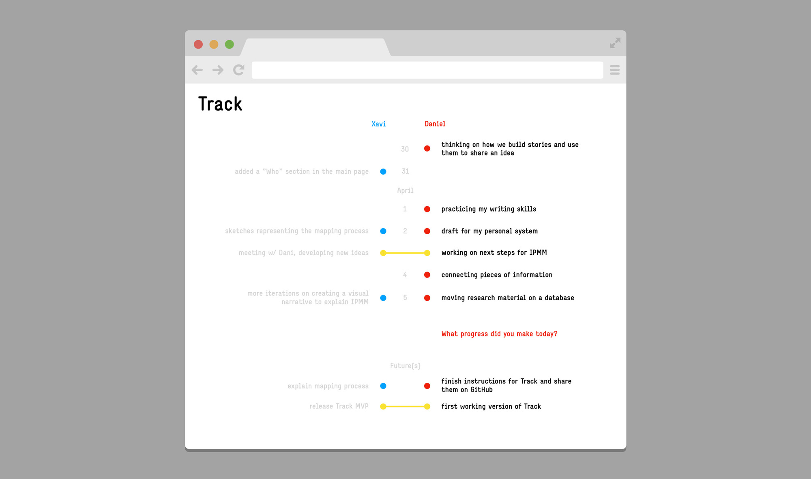

# Track

**Get inspired to keep moving forward, by visualizing your and other people progress.**

You are solely responsible for your actions.

We would like to facilitate those actions by creating an inspiring context, a tool [[1]](#footnote1) that feels comfortable to use, that engages you to **keep doing what you really want to do**. 

**Track** [[2]](#footnote2) visualizes [[3]](#footnote3) the actions you captured using customized forms in Airtable [[4]](#footnote4) in a vertical timeline, side by side with another timeline that inspires you or that act as a backup when your inner drive is not enough to move a step forward.

—

*More information and instructions on how to use **Track** at future iterations of the project, but meanwhile you can read more about the [features](features.md) we are planning to develop or contribute to the list of [related projects](https://github.com/danielarmengolaltayo/track/issues/1).*

   

---

<a id="footnote1">[1]</a> → **Why another tool?**

This is part of the series of experiments done at [IPMM](https://github.com/interplanetarymindmap), on our personal quest to understand how we can use and adapt existent tools or develop new ones that meet our need to **become more effective in how we use time and energy, in order to keep learning and growing as individuals and as a collective**.

We use the term **tool** loosely, at any object, physical or digital, skill and ability that modifies features of the inner or outer environment. We feel special attraction for tools capable to make other tools, tools that you can learn from while you use them, tools that empower.

> "We shape our tools. And then our tools shape us." — Marshall McLuhan

<a id="footnote2">[2]</a> → **What does *Track* mean?**

The term "track" is about evidence that something has passed, about observing how thoughts and ideas materialized into a sequence of actions over time, drawing a path of movement towards a particular purpose.

<a id="footnote3">[3]</a> → **What is *Track*?**

**Track** is a render for a database.

We define **render** as the form information takes when we visualize and process it in a context designed for a specific use. 

We approach information and render as separate but interconnected entities, allowing us to display the same dataset in multiple ways or process different information using the same algorithm.

<a id="footnote4">[4]</a> → **What is *Airtable*?**

[Airtable](https://airtable.com/) is a user friendly database we use for the tracking. 

We are using Airtable for convenience, but we could retrieve the data from somewhere else.

—

*Template for the mockup by [Bruno Felicio](https://dribbble.com/shots/1126404-Flat-Chrome).*