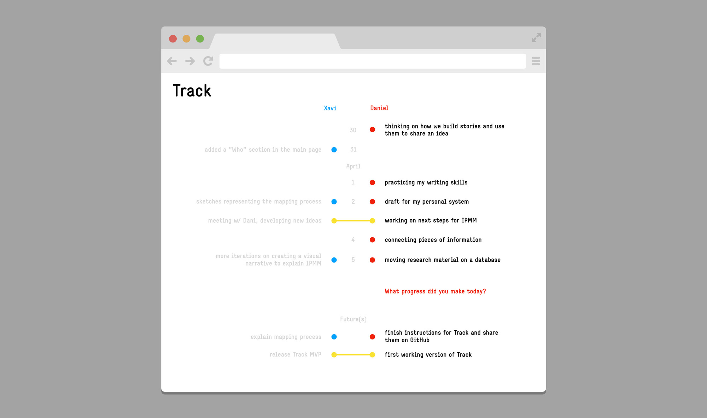

# Track

(short description as intro)

## Why another app?

This is part of the series of experiments done at [IPMM](https://github.com/interplanetarymindmap), on our personal quest to understand how we can use and adapt existent tools [[1]](#footnote1) or develop new ones that meet our need to **become more effective in how we use time and energy, in order to keep learning and growing as individuals and as a collective**.

## How are we going to do it?

**Track** is a render [[2]](#footnote2) for a database. We are using Airtable for convenience, but we could retrieve the data from somewhere else.

(explain more about airtable and about our approach)

## What it does?

### ⏱📉📈 Track your progress

We believe that tracking what you do (as individual or collective) is a good exercise to become more aware of your actions. Accumulation of data on how you behave is a good strategy if you want to evaluate your performance in the past and gain perspective for future iterations.

### 📊👀👌 Make your progress obvious

The effort of maintaining a log of your actions active is a huge effort, it requires commitment and constancy. We know that having the feeling of progress can be used as a reward to keep the habit of tracking going on. We want to design a tool with this idea in mind.

### 👁🔮🏹 Clear and always visible direction and goals

Progress implies movement towards a direction or goal. We must have our vision always present so we do not get lost along the way.

### 🤜💥🤛 Expose yourself to a healthy peer pressure

This is an interesting trick if you use it well. If you are sharing the experience of tracking your progress with someone you respect, you can use the commitment to the other as a backup when yours to yourself is passing a weak moment. Imagine this mental trick to be used in the same way as a support group. The tool can be designed to facilitate this dynamic, but it is up to you how to apply it ;-)

### 🌈✨💪 Use progress from other people to motivate your own

Another mental hack is to find inspiration in the progress of other people. Not envy or competition, those are bad partners in the long term. Inspiration is a powerful source of energy, be aware of it and use it wisely.

### 🎨⚖️🧩 Custom overview

Be inspired by others, be inspired by your own progress, be inspired by your vision. Find inspiration in every detail, and if there is something that is not aligned to you, that is not inspiring, change it. That is why we think it is key to have the chance to customize your tools. And if what we are doing it is not enough for you, we invite you to contribute.

   

## Draft 
notes pending to clean and organize

### Features

- max one thought/idea/action/whatever per day
    - limit of characters (same as twitter?)
    - links
    - you can tag (another field in airtable) a person or a project, to share the record when visualizing your timeline with theirs
        - not need to unique ids, you define the name of the other person or project in settings, linking to the corresponding database
- create your timeline and put it aside onther one
    - your teammate
    - your project
    - your friend or colleage
    - any public timeline
    - any of your other timelines
- you can own as much timelines as you want, private or public
- goals (individual or shared)
- when you open the timeline, it scrolls automatically till finding "today". you always begin at today after the animation of scrolling down (giving you the feeling of progress). today stays in the middle of the screen, so you can see in the same screen some of the past, and your goals for the future (if you have)

### Ideas for future versions:
- more entries per day (e.g. tracking food, different meals per day)
- more formats to choose from when inputting a record (e.g. files, images...)

## Related projects

There are different proposals out there (we are collecting some of them here), and we are not competing with them, since this is more an excuse to learn by doing than a business oriented product.

(create an issue for related projects, and a link "here" to the issue)

references for roadmap applications
- https://tab-snooze.nolt.io/roadmap
- https://nolt.io/

## Footnotes

<a id="footnote1">[1]</a> 

We use the term **tool** loosely, at any object, physical or digital, skill and ability that modifies features of the inner or outer environment. We feel special attraction for tools capable to make other tools, tools that you can learn from while you use them, tools that empower.

> "We shape our tools. And then our tools shape us." — Marshall McLuhan

<a id="footnote2">[2]</a> 

We define **render** as the form information takes when we visualize and process it in a context designed for a specific use. 

We approach information and render as separate but interconnected entities, allowing us to display the same dataset in multiple ways or process different information using the same algorithm.